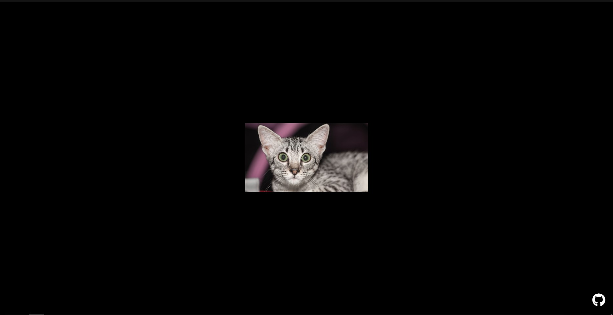

# [🐱 PetTheCat 🐱](https://inttter.github.io/PetTheCat/)

 

PetTheCat is a web application that provides a random image of a cat for you to enjoy and interact with by petting (clicking on) the displayed cat image to hear a meow sound!

## 📝Features 📝
- **Random Cat Images:**
  - Utilizing TheCatAPI (https://thecatapi.com), PetTheCat displays a randomly fetched image of a cat every time you visit the website.

- **Interactivity:**
  - By clicking on the displayed cat image, you can hear a 'meow' sound.

- **Secret Button:**
  - Explore the page...

## 💻 Preview 💻

## 📜 Usage 📜
1. **Access the Website:**
   - Visit the PetTheCat website [here](https://inttter.github.io/PetTheCat/).

2. **Interactivity:**
   - Upon loading the website, a random cat image will appear.
   - Click or tap on the displayed cat image to hear a meow sound.

## ✍ Credits ✍
+ TheCatAPI for the images: https://TheCatAPI.com
+ FontAwesome for the GitHub icon and the...other one. https://fontawesome.com

## 📚 License 📚
PetTheCat is licensed under the [MIT License](LICENSE).

---
### 🍵 Buy me a Coffee! 🍵

